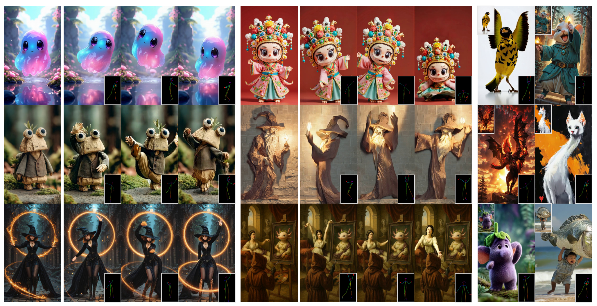

<p align="center">
  <h2 align="center">Animate-X++: Universal Character Image Animation with Dynamic Backgrounds</h2>


  <p align="center">
    <a href=""><strong>Shuai Tan</strong></a>
    ·
    <a href="https://scholar.google.com/citations?user=BwdpTiQAAAAJ"><strong>Biao Gong</strong></a>
    ·
    <a href=""><strong>Zhuoxin Liu</strong></a>
    ·
    <a href="https://scholar.google.com/citations?user=f6FgQ_bXEb4C&hl=en"><strong>Yan Wang</strong></a>
    <a href="https://scholar.google.com/citations?user=WntYF-sAAAAJ&hl=en&oi=ao"><strong>Yifan
                  Feng</strong></a>
    ·
    <a href="https://xavierchen34.github.io/"><strong>Xi Chen</strong></a>
    ·
    <a href="https://hszhao.github.io/"><strong>Hengshuang
                  Zhao</strong></a><sup>†</sup>         
    <br>
    <br>
        <a href="https://arxiv.org/abs/2508.09454"></a>
        <a href='https://lucaria-academy.github.io/Animate-X++/'></a>
        <a href='https://mp.weixin.qq.com/s/vDR4kPLqnCUwfPiBNKKV9A'></a>
        <a href='https://huggingface.co/Shuaishuai0219/Animate-X-plusplus'></a>
    <br>
    <b></a>HKU&nbsp; | &nbsp; </a>Ant Group   </b>
    <br>
  </p>

</p>

This repository is the official implementation of paper "Animate-X++: Universal Character Image Animation with Dynamic Backgrounds". Animate-X++ is a universal animation framework based on latent diffusion models for various character types (collectively named X), including anthropomorphic characters.
  <table align="center">
    <tr>
    <td>
      
    </td>
    </tr>
  </table>


## &#x1F4CC; Updates
* [2025.09.17] 🔥 We release our [Animate-X++](https://github.com/Lucaria-Academy/Animate-X-plusplus) inference codes.
* [2025.09.17] 🔥 We release our [Animate-X++ CKPT](https://huggingface.co/Shuaishuai0219/Animate-X-plusplus) checkpoints.
* [2025.08.12] 🔥 Our [paper](https://arxiv.org/abs/2508.09454) is in public on arxiv.


<!-- <video controls loop src="https://cloud.video.taobao.com/vod/vs4L24EAm6IQ5zM3SbN5AyHCSqZIXwmuobrzqNztMRM.mp4" muted="false"></video> -->

## &#x1F304; Gallery
<!-- ### Introduction 
<table class="center">
<tr>
    <td width=47% style="border: none">
        <video controls loop src="https://github.com/user-attachments/assets/085b70c4-cb68-4ac1-b45f-ed7f1c75bd5c" muted="false"></video>
    </td>
    <td width=53% style="border: none">
        <video controls loop src="https://github.com/user-attachments/assets/f6275c0d-fbca-43b4-b6d6-cf095723729e" muted="false"></video>
    </td>
</tr>
</table> -->

### Animations produced by Animate-X++
<table class="center">
<tr>
    <td width=50% style="border: none">
        <video controls loop src="https://cloud.video.taobao.com/vod/i18qjxKlFXgdcVfNC5XsQy3hHVlt5w2QJbK7UyobGEQ.mp4" muted="false"></video>
    </td>
        <td width=50% style="border: none">
        <video controls loop src="https://cloud.video.taobao.com/vod/b_C5y51HxQ9zZfABcT0WpS81_xl1HLWdemEz5QEBl14.mp4" muted="false"></video>
    </td>
</tr>
</table>

<table class="center">
<tr>
    <td width=50% style="border: none">
        <video controls loop src="https://github.com/user-attachments/assets/732a3445-2054-4e7b-9c2d-9db21c39771e" muted="false"></video>
    </td>
        <td width=50% style="border: none">
        <video controls loop src="https://github.com/user-attachments/assets/f25af02c-e5be-4cab-ae64-c9e0b392643a" muted="false"></video>
    </td>
</tr>
</table>


## &#x1F680; Installation
Install with `conda`: 
```shell
conda create -n Animate-X++ python=3.9.21
# or conda create -n Animate-X++ python=3.10.16 # Python>=3.10 is required for Unified Sequence Parallel (USP)
conda activate Animate-X++

# CUDA 11.8
pip install torch==2.5.0 torchvision==0.20.0 torchaudio==2.5.0 --index-url https://download.pytorch.org/whl/cu118
# CUDA 12.1
pip install torch==2.5.0 torchvision==0.20.0 torchaudio==2.5.0 --index-url https://download.pytorch.org/whl/cu121
# CUDA 12.4
pip install torch==2.5.0 torchvision==0.20.0 torchaudio==2.5.0 --index-url https://download.pytorch.org/whl/cu124

git clone https://github.com/Lucaria-Academy/Animate-X++.git
cd Animate-X++
pip install -e .
```

UniAnimate-DiT supports multiple Attention implementations. If you have installed any of the following Attention implementations, they will be enabled based on priority.

* [Flash Attention 3](https://github.com/Dao-AILab/flash-attention)
* [Flash Attention 2](https://github.com/Dao-AILab/flash-attention)
* [Sage Attention](https://github.com/thu-ml/SageAttention)
* [torch SDPA](https://pytorch.org/docs/stable/generated/torch.nn.functional.scaled_dot_product_attention.html) (default. `torch>=2.5.0` is recommended.)

## &#x1F680; Download Checkpoints

(i) Download Wan2.1-14B-I2V-720P models using huggingface-cli:
```
pip install "huggingface_hub[cli]"
huggingface-cli download Wan-AI/Wan2.1-I2V-14B-720P --local-dir ./Wan2.1-I2V-14B-720P
```

Or download Wan2.1-14B-I2V-720P models using modelscope-cli:
```
pip install modelscope
modelscope download Wan-AI/Wan2.1-I2V-14B-720P --local_dir ./Wan2.1-I2V-14B-720P
```

(ii) Download [Animate-X++ checkpoints](https://huggingface.co/Shuaishuai0219/Animate-X-plusplus) and [Dwpose and CLIP checkpoints](https://huggingface.co/Shuaishuai0219/Animate-X) and put all files in `checkpoints` dir

(iii) Finally, the model weights will be organized in `./checkpoints/` as follows:
```
./checkpoints/
|---- animate-x++.ckpt
|---- animate-x++_simple.ckpt
|---- dw-ll_ucoco_384.onnx
|---- open_clip_pytorch_model.bin
└---- yolox_l.onnx
```


## &#x1F4A1; Inference 

The default inputs are a image (.jpg/.png/.jpeg) and a dance video (.mp4/.mov). The default output is a 81-frame video (.mp4) with 832x480 resolution, which will be saved in `./outputs` dir. We give a set of example data in [Animate-X++ example data](https://huggingface.co/Shuaishuai0219/Animate-X-plusplus). Please put it in ./data

1. pre-process the video.
    ```bash
    python process_data.py \
        --source_video_paths data/videos \
        --saved_pose_dir data/saved_pkl \
        --saved_pose data/saved_pose \
        --saved_frame_dir data/saved_frames
    ```
2. run Animate-X++. We provide a simple version (recommended):
- If you have many GPUs for inference, we also support Unified Sequence Parallel (USP), note that python>=3.10 is required for Unified Sequence Parallel (USP):
    ```bash
    pip install xfuser
    CUDA_VISIBLE_DEVICES=0,1,2,3 torchrun --standalone --nproc_per_node=4 examples/inference_480p_usp.py 
    # or
    CUDA_VISIBLE_DEVICES=0 torchrun --standalone --nproc_per_node=1 examples/inference_480p_usp.py 
    ```
- Full model of Animate-X++:
    ```bash
    CUDA_VISIBLE_DEVICES=0 torchrun --standalone --nproc_per_node=1 examples/inference_480p.py  
    ```

**&#10004; Some tips**:

> Although Animate-x does not rely on strict pose alignment and we did not perform any manual alignment operations for all the results in the paper, we cannot guarantee that all cases are perfect. Therefore, users can perform handmade pose alignment operations themselves, e.g, applying the overall x/y translation and scaling on the pose skeleton of each frame to align with the position of the subject in the reference image. (put in `data/saved_pose`) 


## &#x1F4E7; Acknowledgement
Our implementation is based on [UniAnimate-DiT](https://github.com/ali-vilab/UniAnimate-DiT), [MimicMotion](https://github.com/Tencent/MimicMotion), and [MusePose](https://github.com/TMElyralab/MusePose). Thanks for their remarkable contribution and released code! If we missed any open-source projects or related articles, we would like to complement the acknowledgement of this specific work immediately.

## &#x2696; License
This repository is released under the Apache-2.0 license as found in the [LICENSE](LICENSE) file.

## &#x1F4DA; Citation
If you find this codebase useful for your research, please use the following entry.
```BibTeX
@article{AnimateX++2025,
  title={Animate-X++: Universal Character Image Animation with Dynamic Backgrounds},
  author={Tan, Shuai and Gong, Biao and Liu, Zhuoxin and Wang, Yan and Feng, Yifan and Zhao, Hengshuang},
  journal={arXiv preprint arXiv:2508.09545},
  year={2025}
}

@article{AnimateX2025,
  title={Animate-X: Universal Character Image Animation with Enhanced Motion Representation},
  author={Tan, Shuai and Gong, Biao and Wang, Xiang and Zhang, Shiwei and Zheng, Dandan and Zheng, Ruobing and Zheng, Kecheng and Chen, Jingdong and Yang, Ming},
  journal={ICLR 2025},
  year={2025}
}

@article{Mimir2025,
  title={Mimir: Improving Video Diffusion Models for Precise Text Understanding},
  author={Tan, Shuai and Gong, Biao and Feng, Yutong and Zheng, Kecheng and Zheng, Dandan and Shi, Shuwei and Shen, Yujun and Chen, Jingdong and Yang, Ming},
  journal={arXiv preprint arXiv:2412.03085},
  year={2025}
}
```